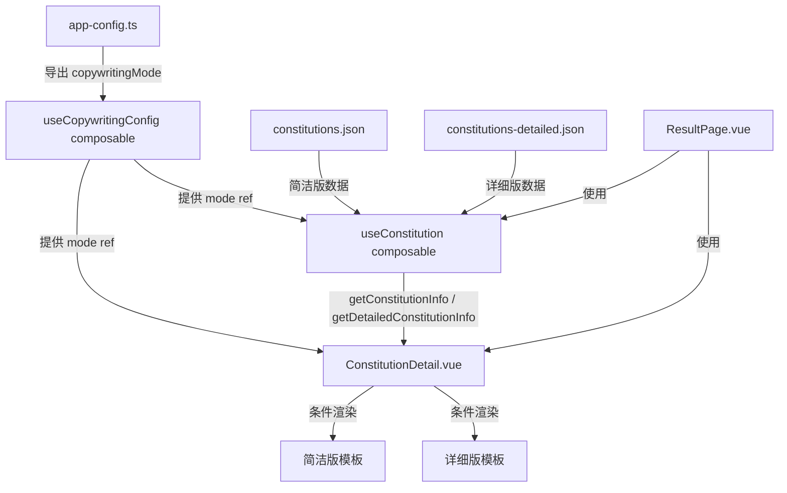

# Design Document: Configurable Constitution Copywriting

## Overview

本设计实现体质文案可配置切换功能，允许 TCM 体质问卷应用在"简洁版"和"详细版"两套文案之间通过构建时配置进行切换。

**核心设计决策：**

- 采用构建时配置（非运行时切换），通过 `src/config/app-config.ts` 静态导出配置值
- 详细版数据以独立 JSON 文件存储（`src/data/constitutions-detailed.json`），与现有简洁版数据解耦
- 通过 Vue composable 模式暴露配置，保持与项目现有架构风格一致
- `ConstitutionDetail.vue` 组件根据配置条件渲染不同模板区域

## Architecture



**数据流：**

1. `app-config.ts` 定义静态配置常量 `copywritingMode`
2. `useCopywritingConfig()` composable 将配置包装为 readonly ref
3. `useConstitution` composable 根据 mode 决定从哪个数据源查询
4. `ConstitutionDetail.vue` 根据 mode 条件渲染对应模板

## Components and Interfaces

### 1. 类型定义扩展 (`src/types/constitution.ts`)

```typescript
/** 9种体质标识符联合类型 */
export type ConstitutionId =
  | 'pinghe'
  | 'qixu'
  | 'yangxu'
  | 'yinxu'
  | 'tanshi'
  | 'shire'
  | 'xueyu'
  | 'qiyu'
  | 'tebing';

/** 文案模式 */
export type CopywritingMode = 'concise' | 'detailed';

/** 药膳方 */
export interface MedicinalRecipe {
  name: string;
  preparation: string;
}

/** 详细版体质信息 */
export interface DetailedConstitutionInfo {
  id: ConstitutionId;
  name: string;
  description: string;
  causes: string[]; // 至少1个元素
  dietaryAdvice: string;
  recommendedFoods: string;
  avoidFoods: string;
  medicinalRecipes: MedicinalRecipe[]; // 至少1个元素
}
```

### 2. 配置模块 (`src/config/app-config.ts`)

```typescript
import type { CopywritingMode } from 'src/types/constitution';

export interface AppConfig {
  copywritingMode: CopywritingMode;
}

const appConfig: AppConfig = {
  copywritingMode: 'concise', // 修改此值切换文案版本
};

export default appConfig;
```

### 3. 配置 Composable (`src/composables/useCopywritingConfig.ts`)

```typescript
import { readonly, ref } from 'vue';
import type { CopywritingMode } from 'src/types/constitution';
import appConfig from 'src/config/app-config';

const VALID_MODES: CopywritingMode[] = ['concise', 'detailed'];

function resolveMode(value: unknown): CopywritingMode {
  if (typeof value === 'string' && VALID_MODES.includes(value as CopywritingMode)) {
    return value as CopywritingMode;
  }
  return 'concise';
}

export function useCopywritingConfig() {
  const mode = ref<CopywritingMode>(resolveMode(appConfig.copywritingMode));
  return {
    mode: readonly(mode),
  };
}
```

### 4. 数据访问层扩展 (`src/composables/useConstitution.ts`)

新增 `getDetailedConstitutionInfo` 函数：

```typescript
import detailedData from 'src/data/constitutions-detailed.json';
import type { DetailedConstitutionInfo } from 'src/types/constitution';

function getDetailedConstitutionInfo(id: string): DetailedConstitutionInfo | undefined {
  return (detailedData.constitutions as DetailedConstitutionInfo[]).find((c) => c.id === id);
}
```

### 5. 数据验证工具 (`src/utils/validate-detailed-data.ts`)

```typescript
import type { DetailedConstitutionInfo, ConstitutionId } from 'src/types/constitution';

const VALID_IDS: ConstitutionId[] = [
  'pinghe',
  'qixu',
  'yangxu',
  'yinxu',
  'tanshi',
  'shire',
  'xueyu',
  'qiyu',
  'tebing',
];

export function validateDetailedData(entries: unknown[]): DetailedConstitutionInfo[] {
  if (entries.length !== 9) {
    throw new Error(`Expected 9 constitution entries, got ${entries.length}`);
  }

  for (const entry of entries) {
    const e = entry as Record<string, unknown>;
    if (!e.id || !VALID_IDS.includes(e.id as ConstitutionId)) {
      throw new Error(`Invalid or missing constitution id: "${e.id}"`);
    }
    // 验证必填字段非空
    for (const field of [
      'name',
      'description',
      'dietaryAdvice',
      'recommendedFoods',
      'avoidFoods',
    ]) {
      if (!e[field] || (typeof e[field] === 'string' && (e[field] as string).trim() === '')) {
        throw new Error(`Constitution "${e.id}": field "${field}" is empty or missing`);
      }
    }
    if (!Array.isArray(e.causes) || e.causes.length === 0) {
      throw new Error(`Constitution "${e.id}": "causes" must be a non-empty array`);
    }
    if (!Array.isArray(e.medicinalRecipes) || e.medicinalRecipes.length === 0) {
      throw new Error(`Constitution "${e.id}": "medicinalRecipes" must be a non-empty array`);
    }
  }

  return entries as DetailedConstitutionInfo[];
}
```

### 6. ConstitutionDetail 组件更新 (`src/components/ConstitutionDetail.vue`)

组件接收新的可选 prop `detailedInfo`，根据 mode 条件渲染：

```typescript
// Props 扩展
defineProps<{
  constitutionInfo: ConstitutionInfo;
  scoreResult: ScoreResult;
  detailedInfo?: DetailedConstitutionInfo;
  mode: CopywritingMode;
}>();
```

模板使用 `v-if="mode === 'detailed'"` 和 `v-else` 切换两套渲染逻辑。

## Data Models

### 详细版数据 JSON 结构 (`constitutions-detailed.json`)

```json
{
  "constitutions": [
    {
      "id": "pinghe",
      "name": "平和质",
      "description": "...",
      "causes": ["先天禀赋良好", "后天调养得当"],
      "dietaryAdvice": "...",
      "recommendedFoods": "...",
      "avoidFoods": "...",
      "medicinalRecipes": [
        {
          "name": "药膳名称",
          "preparation": "制作方法..."
        }
      ]
    }
  ]
}
```

### 数据关系

| 数据源 | 文件路径                               | 模式     | 条目数 |
| ------ | -------------------------------------- | -------- | ------ |
| 简洁版 | `src/data/constitutions.json`          | concise  | 9      |
| 详细版 | `src/data/constitutions-detailed.json` | detailed | 9      |

两个数据源通过 `id` 字段关联，共享相同的 9 个体质标识符。

## Correctness Properties

_A property is a characteristic or behavior that should hold true across all valid executions of a system—essentially, a formal statement about what the system should do. Properties serve as the bridge between human-readable specifications and machine-verifiable correctness guarantees._

### Property 1: Validation rejects invalid data with specific error reporting

_For any_ array of constitution-like objects that violates at least one constraint (wrong count, invalid ID, empty required field, empty causes array, or empty medicinalRecipes array), the `validateDetailedData` function SHALL throw an error whose message identifies the specific entry or field that failed validation.

**Validates: Requirements 2.4, 2.5**

### Property 2: Config fallback for invalid values

_For any_ string value that is not exactly `'concise'` or `'detailed'`, the `resolveMode` function SHALL return `'concise'`.

**Validates: Requirements 3.2, 5.5**

### Property 3: Detailed mode renders all required sections

_For any_ valid `DetailedConstitutionInfo` object with non-empty `causes` and `medicinalRecipes` arrays, rendering the `ConstitutionDetail` component in `detailed` mode SHALL produce output containing all six sections: 体质描述, 形成原因, 饮食调养, 宜食, 少食, 推荐药膳.

**Validates: Requirements 4.1**

### Property 4: Concise mode renders all required fields

_For any_ valid `ConstitutionInfo` object, rendering the `ConstitutionDetail` component in `concise` mode SHALL produce output containing all six fields: 主要特征, 形体特征, 常见表现, 心理特征, 发病倾向, 环境适应能力.

**Validates: Requirements 4.2**

### Property 5: Causes array renders as distinct elements

_For any_ valid `DetailedConstitutionInfo` object with N causes (N ≥ 1), rendering the `ConstitutionDetail` component in `detailed` mode SHALL produce exactly N distinct chip/badge elements, each containing one cause string from the array.

**Validates: Requirements 4.3**

### Property 6: Recipes array renders as distinct list items

_For any_ valid `DetailedConstitutionInfo` object with M medicinal recipes (M ≥ 1), rendering the `ConstitutionDetail` component in `detailed` mode SHALL produce exactly M distinct list items, each displaying the recipe `name` as a label and the `preparation` as body content.

**Validates: Requirements 4.4**

### Property 7: getDetailedConstitutionInfo lookup correctness

_For any_ string `id`, `getDetailedConstitutionInfo(id)` SHALL return a `DetailedConstitutionInfo` object with matching `id` if and only if `id` is one of the 9 valid constitution identifiers present in the detailed data store; otherwise it SHALL return `undefined`.

**Validates: Requirements 6.1, 6.3**

## Error Handling

| 场景                                                 | 处理策略                                                  |
| ---------------------------------------------------- | --------------------------------------------------------- |
| `constitutions-detailed.json` 加载失败               | 应用启动时抛出错误，阻止渲染（开发阶段即可发现）          |
| 数据验证失败（缺少条目/无效ID/空字段）               | `validateDetailedData` 抛出描述性错误，指明具体条目和字段 |
| `copywritingMode` 配置值无效                         | 静默回退到 `'concise'` 模式                               |
| `getDetailedConstitutionInfo` 查询不存在的 ID        | 返回 `undefined`，由组件层决定是否显示                    |
| 详细版数据中 `causes` 或 `medicinalRecipes` 为空数组 | 组件隐藏对应区域，不显示空白节                            |

**设计原则：**

- 数据完整性问题在开发/构建阶段尽早暴露（fail fast）
- 配置容错采用安全默认值（concise）
- 运行时查询失败返回 `undefined`，不抛异常

## Testing Strategy

### 测试框架

- **单元测试 & 属性测试**: Vitest + `@fast-check/vitest`（项目已安装）
- **组件测试**: Vitest + `@vue/test-utils`（需添加依赖）

### 属性测试（Property-Based Testing）

PBT 适用于本功能，因为：

- 验证函数 `validateDetailedData` 是纯函数，输入空间大（各种无效数据组合）
- 配置解析 `resolveMode` 是纯函数，输入为任意字符串
- 数据查询 `getDetailedConstitutionInfo` 是纯函数，输入为任意字符串 ID
- 组件渲染可通过生成随机有效数据验证渲染完整性

**配置要求：**

- 每个属性测试最少运行 100 次迭代
- 每个测试用注释标注对应的设计属性
- 标注格式: `Feature: configurable-constitution-copywriting, Property {number}: {property_text}`

### 测试分层

| 层级       | 测试类型 | 覆盖内容                                            |
| ---------- | -------- | --------------------------------------------------- |
| 数据验证   | 属性测试 | Property 1: 生成各种无效数据组合，验证拒绝+错误信息 |
| 配置解析   | 属性测试 | Property 2: 生成任意字符串，验证回退行为            |
| 组件渲染   | 属性测试 | Property 3-6: 生成随机有效数据，验证渲染完整性      |
| 数据查询   | 属性测试 | Property 7: 生成随机 ID 字符串，验证查询正确性      |
| 数据完整性 | 单元测试 | 验证 JSON 文件包含 9 个完整条目                     |
| 集成测试   | 单元测试 | 验证 ResultPage 在两种模式下正确渲染                |

### 单元测试重点

- 验证 `constitutions-detailed.json` 的 9 个条目数据完整性
- 验证 `useCopywritingConfig()` 返回正确的 readonly ref
- 验证组件在 `causes`/`medicinalRecipes` 为空时隐藏对应区域（边界情况）
- 验证 `ResultPage.vue` 在两种模式下的集成行为
